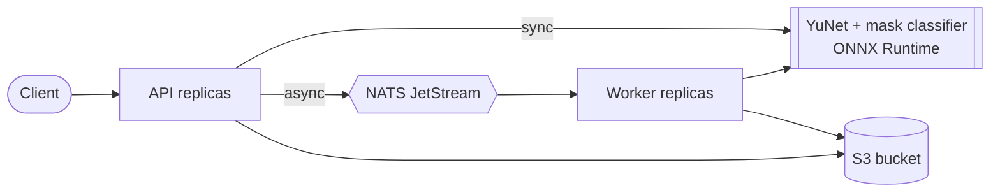

# Face Mask Detection Service

[](https://github.com/chan4kum/opencv-face-mask-detection/actions/workflows/ci.yml)
[](https://github.com/chan4kum/opencv-face-mask-detection/actions/workflows/codeql.yml)
[](LICENSE)


A production-grade, horizontally scalable service that finds faces and classifies whether each is **wearing a mask**. The model is **trained in this repository**
on a public-domain dataset, with a reproducible pipeline, honest held-out evaluation and a serving stack (API, workers, observability, Helm chart, CI/CD) around it.

> **Read [docs/EVALUATION.md](docs/EVALUATION.md) and [docs/MODEL_CARD.md](docs/MODEL_CARD.md) first.** On unseen images the classifier is 96.9% accurate on known face boxes, but
> **end to end it finds only about 76% of faces**, and it is **weak at `mask_weared_incorrect` (37.5% recall)**. Counts are lower bounds. It is not for enforcement or decisions about people.

* **Pipeline:** YuNet face detection (small images upscaled first), then a MobileNetV3-Small classifier per face: `with_mask`, `without_mask`, `mask_weared_incorrect`, plus `uncertain` and `low_resolution` flags.
* **Reproducible training** in [`training/`](training/): pinned dataset revision with a per-file manifest, image-level splits, validation-only model selection and calibration, one pass over the test split, ONNX export with a parity check.
* **No train/serve skew:** training imports the service's own crop and preprocessing code, and a test checks the model's recorded settings against the serving constants.
* **Distributed and cloud-agnostic:** stateless API + workers over **NATS JetStream**, **S3-compatible** storage, Docker/Kubernetes, Prometheus/Grafana, OpenTelemetry.
* **Secure by default:** hashed API keys, strict input validation, non-root read-only container, network policies, checksum-pinned models.



## Quick start

```bash
docker compose --profile observability up -d --build --wait

curl -s -X POST localhost:8000/v1/analyze -H 'Content-Type: image/png' \
     --data-binary @tests/data/maksssksksss520.png | jq '{summary, mask: .faces[0].mask}'

curl -s -X POST localhost:8000/v1/analyze/annotated -H 'Content-Type: image/png' \
     --data-binary @tests/data/maksssksksss716.png -o annotated.jpg     # green = mask, red = no mask, orange = incorrect, grey = uncertain

ID=$(curl -s -X POST localhost:8000/v1/jobs -H 'Content-Type: image/png' --data-binary @tests/data/maksssksksss520.png | jq -r .job_id)
curl -s localhost:8000/v1/jobs/$ID | jq
```

The three `maksssksksss*.png` samples are CC0 images from the held-out test split, one per class, with ground truth in `tests/data/samples.json`.

### CLI / library (no servers)

```bash
uv sync
uv run mask-detection analyze photo.jpg -o annotated.jpg     # JSON on stdout
uv run mask-detection webcam                                  # live demo (needs GUI OpenCV)
uv run mask-detection verify-models
```

```python
import cv2
from pathlib import Path
from mask_detection.config import DEFAULT_MASK_MODEL_SHA256, DEFAULT_MODEL_SHA256
from mask_detection.detector import YuNetDetector
from mask_detection.mask import MaskClassifier

detector = YuNetDetector(
    Path("models/face_detection_yunet_2026may.onnx"), expected_sha256=DEFAULT_MODEL_SHA256, upscale_to=1024
)
classifier = MaskClassifier(Path("models/mask_classifier.onnx"), expected_sha256=DEFAULT_MASK_MODEL_SHA256)
image = cv2.imread("photo.jpg")
for face in detector.detect(image):
    est = classifier.classify_face(image, (face.x, face.y, face.width, face.height))
    print(est.label, round(est.confidence, 3), "uncertain" if est.uncertain else "")
```

> The webcam demo needs GUI OpenCV: `uv pip uninstall opencv-python-headless && uv pip install opencv-python`.

## API

| Endpoint | Description |
|---|---|
| `POST /v1/analyze` | Raw image bytes (`image/jpeg`, `png`, `webp`, `bmp`). Returns each face's box, landmarks and `mask`, plus a `summary` of counts. |
| `POST /v1/analyze/annotated` | Same input; returns a JPEG with coloured boxes and labels (`X-Face-Count` header). |
| `POST /v1/jobs`, `GET /v1/jobs/{id}` | Asynchronous analysis; only the submitting API key can read a job. |
| `GET /v1/models`, `/healthz`, `/readyz`, `/metrics` | Model metadata and checksums; liveness; readiness (models, NATS, object storage); Prometheus. |

Errors are [RFC 9457](https://www.rfc-editor.org/rfc/rfc9457) `application/problem+json` with a `request_id`. Auth: `Authorization: Bearer <key>` (`mask-detection keygen`).

<details><summary>Example response</summary>

```json
{
  "image": {"width": 512, "height": 366},
  "faces": [{
    "box": {"x": 41.5, "y": 172.0, "width": 113.2, "height": 132.0}, "score": 0.98,
    "landmarks": {"right_eye": {"x": 76.1, "y": 210.4}, "...": "..."},
    "mask": {"label": "with_mask", "confidence": 0.9996, "uncertain": false, "low_resolution": false,
             "probabilities": {"with_mask": 0.9996, "without_mask": 0.0003, "mask_weared_incorrect": 0.0001}}
  }],
  "summary": {"faces": 1, "with_mask": 1, "without_mask": 0, "mask_weared_incorrect": 0, "uncertain": 0},
  "inference_ms": 32.4,
  "models": {"face_detector": {"name": "yunet-2026may", "...": "..."}, "mask_classifier": {"name": "mobilenetv3-small-mask-cc0", "...": "..."}},
  "request_id": "9b1d..."
}
```
</details>

## Configuration

Environment variables prefixed `MD_`, validated at start-up. The important ones:

| Variable | Default | Purpose |
|---|---|---|
| `MD_ENVIRONMENT` | `dev` | `prod` requires `MD_API_KEY_HASHES` (or an explicit `MD_AUTH_DISABLED=true`) |
| `MD_MASK_MIN_CONFIDENCE` | `0.7` | Below this a face is flagged `uncertain` |
| `MD_DETECTOR_UPSCALE_TO` | `1024` | Small images are enlarged to this longest side so tiny faces are found (0 = off) |
| `MD_SCORE_THRESHOLD` | `0.7` | Face detection threshold (raise for fewer false detections, lower for more recall) |
| `MD_LOW_RESOLUTION_PX` | `24` | Faces with a shorter side below this get `low_resolution: true` |
| `MD_MAX_FACES` | `200` | Faces analysed per image |
| `MD_ASYNC_ENABLED`, `MD_NATS_URL`, `MD_S3_*` | see `config.py` | Async pipeline backing services |

Complete reference: [`src/mask_detection/config.py`](src/mask_detection/config.py).

## Retrain

```bash
python training/fetch_dataset.py /tmp/maskdata          # verified against training/dataset_manifest.json
python training/tune_detector.py /tmp/maskdata          # detector settings, chosen on validation images
python training/train.py --data /tmp/maskdata --out models
python training/make_report.py                           # regenerates docs/EVALUATION.md
```

See [training/README.md](training/README.md). Training takes about a minute on an Apple GPU.

## Deploy

Docker Compose (above); Kubernetes via the Helm chart in [`deploy/helm/mask-detection`](deploy/helm/mask-detection); guide, production checklist and AWS mapping in [docs/DEPLOYMENT.md](docs/DEPLOYMENT.md).

## Measured behaviour

One API container in a Linux VM on an Apple M4 Pro (Docker Desktop), 512 px image with two faces, real models (reproduce with `make bench`):

| Concurrent clients | Throughput | p50 | p95 | Errors |
|---|---|---|---|---|
| 1 | 43.7 req/s | 22.6 ms | 24.8 ms | 0 |
| 4 | 159.7 req/s | 24.6 ms | 28.5 ms | 0 |
| 16 | 182.9 req/s | 87.1 ms | 91.1 ms | 0 |

Image size 178 MB; 286 MiB memory after load. Classification is about 3 ms per face; the detector (with upscaling) dominates.

## Verification status

| Area | How it was verified | Result |
|---|---|---|
| Model quality | Held-out test split (128 images, 551 faces), classifier and end to end, by class and by face size | see [EVALUATION.md](docs/EVALUATION.md): 96.9% on boxes; 76% of faces found end to end |
| Train/serve consistency | Shared crop code + test comparing the model's recorded settings and checksum to the service constants; ONNX vs PyTorch parity | max difference 3e-6 |
| Tests | Real models, real held-out CC0 images with ground truth; NATS JetStream + S3 for the async path | 140 pass, 95% combined coverage |
| Container | Built and run non-root / read-only / no capabilities; three ground-truth images through the API | 2 of 3 correct; the third is the known-weak class |
| Kubernetes (kind) | Chart install, `helm test`, auth (401/401/200), analysis, async job; 30 jobs queued while workers were parked, NATS restarted, workers restored | 30/30 succeeded, none lost |
| Helm chart | `helm lint --strict`; every emitted `MD_*` variable is a real setting (test) | passes |

**Not verified:** fairness across demographic groups, other cameras / mask types / poses, generalisation beyond this dataset's web photos, calibration on unseen data, KEDA and prometheus-operator resources, NetworkPolicy enforcement on your CNI, multi-arch image build and signing (release workflow only).

## Development

```bash
uv sync --all-groups && uv run pre-commit install
make lint        # ruff, ruff format, mypy --strict
make test        # unit tests
make up && make test-integration
```

See [CONTRIBUTING.md](CONTRIBUTING.md), [docs/RUNBOOK.md](docs/RUNBOOK.md), [SECURITY.md](SECURITY.md), [docs/adr](docs/adr).

## License

MIT (code and the trained weights). Training data: Kaggle *Face Mask Detection*, declared CC0 1.0 (see the [model card](docs/MODEL_CARD.md) for caveats). YuNet face detector: MIT (`models/YUNET_README.md`).
